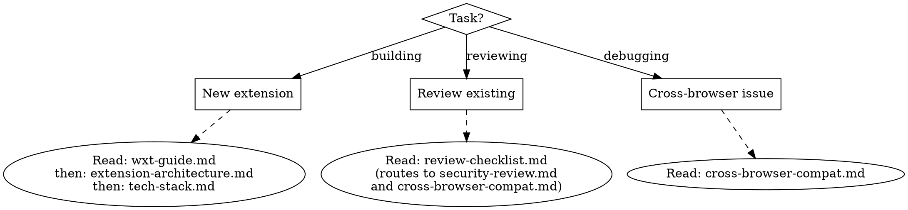

# Building Browser Extensions

Build cross-compatible browser extensions (Chrome, Firefox, Safari) using **WXT** with TypeScript. Also provides structured codebase review for existing extensions.

**Framework:** WXT is prescribed — not optional. It handles manifest generation, cross-browser targeting, HMR, and the service-worker/event-page divergence automatically.

## Routing

## References

- **wxt-guide.md** — Scaffolding, project structure, dev workflow, build commands, WXT modules
- **extension-architecture.md** — Execution contexts, message passing, storage, permissions, service worker lifecycle
- **tech-stack.md** — UI frameworks, testing, linting, recommended libraries
- **security-review.md** — Permissions audit, CSP, unsafe patterns, store rejection pitfalls
- **cross-browser-compat.md** — MV3 status, API gaps, Safari constraints, background context divergence
- **review-checklist.md** — Structured 4-phase codebase review process
